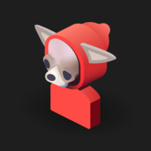
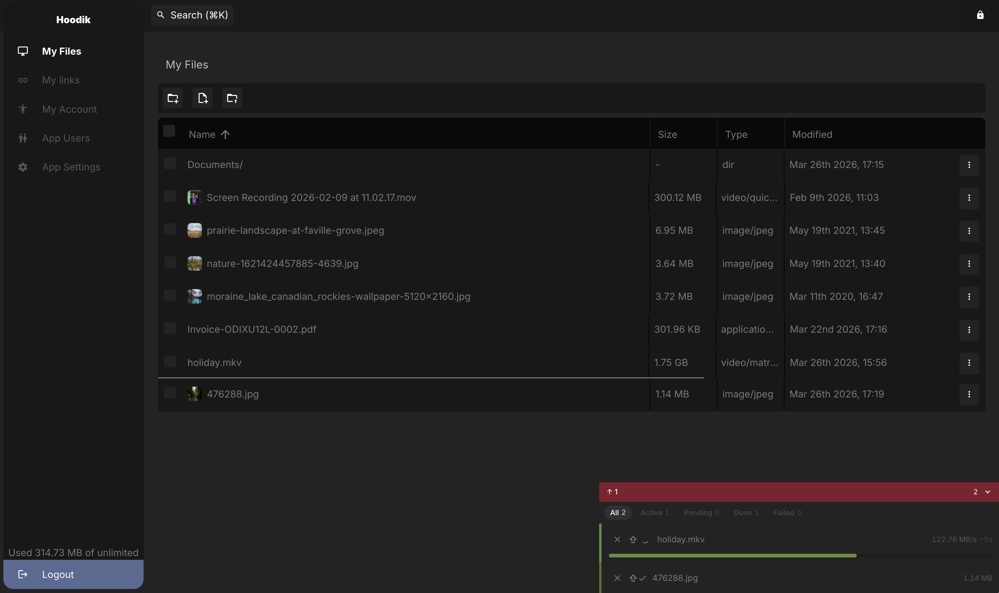

# Hoodik

<p align="center">
  
</p>

Hoodik is a lightweight, secure, and self-hosted cloud storage solution. It's designed and built with Rust and Vue, focusing on end-to-end encryption that shields your data from prying eyes and hackers. Hoodik supports file uploading and downloading, making it easy for you to share files with other users. The simple and intuitive web interface makes file management a breeze. Thanks to Rust's focus on speed and performance, your data transfers will be lightning fast.

<p align="center">
  
</p>

## Features

Hoodik is designed with a central goal: to store your files securely. Files are encrypted and decrypted on your device during download and upload.

To ensure end-to-end encryption remains fast and efficient while enabling file sharing among application users, a hybrid encryption approach is used:
- Upon registration, each user receives a generated RSA key pair.
- We store your keys, encrypted with your passphrase, with your information on the server (choose a robust passphrase).
- Files are encrypted with a randomly generated AES key during upload.
- The file's AES key is encrypted with the user's public key and stored in the database, linking the user and the file.

We've created a mechanism to enable search through your files without leaving plaintext metadata in the database:
- Any searchable data about the file (like name, metadata, etc.) is tokenized.
- The resulting tokens are hashed and stored in the database as file tokens.
- When you perform a search, we perform the same operation on your search query and transmit it to the server.
- The server matches tokens to the query and fetches the corresponding files from the database.

The process for publicly sharing links to files protects the actual file's AES key:
- A random AES key is generated for the link.
- The file metadata is encrypted with the link key.
- The original file's AES key is encrypted with the link key.
- The link key is encrypted with the owner's RSA key (enabling the owner to retrieve the key anytime).
- When someone clicks the link, the link key will either be included in the link `https://.../links/{id}#link-key`, or they need to input it in the client app before starting the download.
- On the download request, the link key is sent to the server where the actual file key is decrypted in memory.
- The file content is streamed for download and is decrypted in memory.

For RSA, we employ 2048-bit [PKCS#1](https://en.wikipedia.org/wiki/PKCS_1) keys, and for AES, we use [AEAD Ascon-128a](https://ascon.iaik.tugraz.at/). You can find detailed usage of the crypto in the `cryptfns` workspace member. We chose this encryption setup because it offers impressive performance results.

Files are stored in chunks and each chunk is encrypted individually. This enables concurrent uploading and downloading of chunks to offset encryption overhead.

*Just to note, in the case of downloading publicly linked files, the shared key only unlocks the link. The actual file key is encrypted within the link and decrypts the file as it downloads. This design ensures the person receiving the shared link never gets the file key.

**We provide the option of server-based encryption and decryption as a fallback solution if the client runs on a device with limited computing power. However, this feature is expected to be used rarely.*

## Installing via Docker

While the application itself can handle incoming traffic, we recommend using a reverse proxy, such as [Nginx Proxy Manager](https://nginxproxymanager.com/), for optimal results.

```shell
docker run --name hoodik -it -d \
  -e DATA_DIR='/data' \
  -e APP_URL='https://my-app.local' \
  -e SSL_CERT_FILE='/data/my-cert-file.crt.pem' \
  -e SSL_KEY_FILE='/data/my-key-file.key.pem' \
  -e MAILER_TYPE='smtp' \
  -e SMTP_ADDRESS='smtp.gmail.com' \
  -e SMTP_USERNAME='email@gmail.com' \
  -e SMTP_PASSWORD='google-account-app-password' \
  -e SMTP_PORT='465' \
  -e SMTP_DEFAULT_FROM='Hoodik Drive <email@gmail.com>' \
  --volume "$(pwd)/data:/data" \
  -p 4554:5443 \
  hudik/hoodik:latest
```

## Database

Hoodik supports either `Sqlite` or `Postgres` databases. `Sqlite` is enabled by default and it creates a database file in your `DATA_DIR` right out of the box. If you prefer an external `Postgres` database, simply provide the `DATABASE_URL` for your `Postgres` connection.

**Please take note: The databases used with Hoodik are not interchangeable. Should you decide to switch from one database type to another after you've begun using the application, this could result in the loss of all your data.**

## Configuration

For a more detailed application configuration, please review our [environment example](./.env.example).

## Contributors

- We thank [Nikola Matošević -Your Dear Designer](https://yourdeardesigner.com/) for the Little Hoodik logo. ❤️
