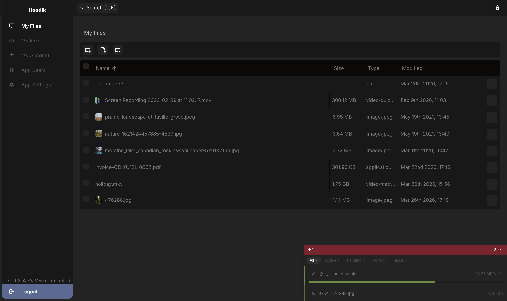

# Hoodik

<p align="center">
  
</p>

<p align="center">
  <a href="https://github.com/hudikhq/hoodik/actions/workflows/test.yml"></a>
  <a href="https://hub.docker.com/r/hudik/hoodik"></a>
  <a href="./LICENSE.md"></a>
</p>

Hoodik is a lightweight, self-hosted, end-to-end encrypted cloud storage server. All encryption and decryption happens in your browser — the server never sees your plaintext data. Built with Rust (Actix-web) on the backend and Vue 3 on the frontend.

🌐 **[hoodik.io](https://hoodik.io)** — Website &nbsp;|&nbsp; 📱 **[Android App](https://play.google.com/store/apps/details?id=com.hudikhq.hoodik)** &nbsp;|&nbsp; ⚡ **[VPS Setup Guide](https://hoodik.io/get-started)**

<p align="center">
  
</p>

---

## Features

- **End-to-end encryption** — files are encrypted in the browser before upload and decrypted after download using a hybrid RSA + AEGIS-128L scheme
- **Secure search** — file metadata is tokenized and hashed so the server can match search queries without storing plaintext names
- **Public sharing links** — share files via a link; the file key is never exposed to the recipient
- **Two-factor authentication** — optional TOTP-based 2FA per user
- **Admin dashboard** — manage users, sessions, invitations, and application settings
- **Chunked transfers** — files are split into encrypted chunks for concurrent upload/download
- **SQLite or PostgreSQL** — SQLite out of the box, PostgreSQL via a single environment variable
- **Docker-first** — single container deployment; multi-arch images (amd64, armv6, armv7, arm64)

---

## How encryption works

### File storage

Each user gets an RSA-2048 key pair on registration. The private key is stored encrypted with your passphrase — the server cannot read it.

> ⚠️ **Store your private key somewhere safe** (e.g. a password manager). If you forget your password, the private key is the only way to recover your account and decrypt your files.

When you upload a file:
1. A random symmetric key is generated for the file (key size depends on the cipher).
2. The file is encrypted chunk-by-chunk with that key using the file's cipher (default: AEGIS-128L).
3. The cipher identifier and the encrypted key are stored in the database alongside the file, so old files can always be decrypted with the correct algorithm even after the default cipher changes.

### Search

Searchable metadata (file name, etc.) is tokenized, hashed, and stored as opaque tokens. When you search, the same operation is applied to your query and the hashes are matched server-side — no plaintext ever leaves the browser.

### Public links

When you share a file:
1. A random link key is generated.
2. The file metadata and file key are encrypted with the link key.
3. The link key itself is encrypted with your RSA public key (so you can always recover it).
4. The link key is appended to the share URL as a fragment: `https://…/links/{id}#link-key`.

The recipient's browser uses the fragment to decrypt the file key locally. The server only ever sees encrypted bytes.

### Cryptographic primitives

| Primitive | Algorithm |
|-----------|-----------|
| Asymmetric | RSA-2048 PKCS#1 |
| Symmetric (default) | AEGIS-128L — hardware-accelerated AEAD via WASM SIMD128/relaxed-simd |
| Symmetric (supported) | Ascon-128a, ChaCha20-Poly1305 |
| Key derivation | SHA-2, Blake2b |

The cipher used to encrypt each file is stored in the database (`files.cipher`), so the correct algorithm is always used for decryption regardless of what the current default is.

---

## Getting started

### Docker (quickstart)

```shell
docker run --name hoodik -d \
  -e DATA_DIR='/data' \
  -e APP_URL='https://my-app.example.com' \
  --volume "$(pwd)/data:/data" \
  -p 5443:5443 \
  hudik/hoodik:latest
```

This runs with a self-signed TLS certificate generated automatically in `DATA_DIR`. For production, provide your own certificate (see [Configuration](#configuration)) or put Hoodik behind a reverse proxy such as [Nginx Proxy Manager](https://nginxproxymanager.com/).

### Docker with email and custom TLS

```shell
docker run --name hoodik -d \
  -e DATA_DIR='/data' \
  -e APP_URL='https://my-app.example.com' \
  -e SSL_CERT_FILE='/data/my-cert.crt.pem' \
  -e SSL_KEY_FILE='/data/my-key.key.pem' \
  -e MAILER_TYPE='smtp' \
  -e SMTP_ADDRESS='smtp.gmail.com' \
  -e SMTP_USERNAME='you@gmail.com' \
  -e SMTP_PASSWORD='your-app-password' \
  -e SMTP_PORT='465' \
  -e SMTP_DEFAULT_FROM_EMAIL='you@gmail.com' \
  -e SMTP_DEFAULT_FROM_NAME='Hoodik Drive' \
  --volume "$(pwd)/data:/data" \
  -p 5443:5443 \
  hudik/hoodik:latest
```

> **Tip:** Set `JWT_SECRET` to a stable random string so sessions survive container restarts.

---

## Configuration

All configuration is done through environment variables. A full reference is in [`.env.example`](./.env.example).

### Core

| Variable | Default | Description |
|----------|---------|-------------|
| `DATA_DIR` | *(required)* | Directory for the database and stored files |
| `DATABASE_URL` | *(SQLite)* | PostgreSQL connection string — omit to use SQLite |
| `APP_URL` | `https://localhost:5443` | Public URL of the application |
| `APP_CLIENT_URL` | `APP_URL` | URL of the frontend (set to Vite dev server during development) |
| `HTTP_PORT` | `5443` | Port the server listens on |
| `HTTP_ADDRESS` | `localhost` | Bind address (`0.0.0.0` in Docker) |

> **Database note:** SQLite and PostgreSQL databases are not interchangeable. Switching after data has been written will result in data loss.

### TLS

| Variable | Default | Description |
|----------|---------|-------------|
| `SSL_DISABLED` | `false` | Disable TLS entirely — for development/testing only |
| `SSL_CERT_FILE` | `DATA_DIR/hoodik.crt.pem` | Path to TLS certificate (auto-generated self-signed cert if missing) |
| `SSL_KEY_FILE` | `DATA_DIR/hoodik.key.pem` | Path to TLS private key (auto-generated if missing) |

### Authentication & sessions

| Variable | Default | Description |
|----------|---------|-------------|
| `JWT_SECRET` | *(random)* | Secret for signing JWTs — **set this** or all sessions are invalidated on restart |
| `LONG_TERM_SESSION_DURATION_DAYS` | `30` | How many days an idle session stays alive |
| `SHORT_TERM_SESSION_DURATION_SECONDS` | `120` | How many seconds the short-lived access token lives; refreshed automatically while the user is active |
| `SESSION_COOKIE` | `hoodik_session` | Name of the session cookie |
| `REFRESH_COOKIE` | `hoodik_refresh` | Name of the refresh token cookie |
| `COOKIE_HTTP_ONLY` | `true` | Hide the session cookie from JavaScript |
| `COOKIE_SECURE` | `true` | Only send cookies over HTTPS |
| `COOKIE_SAME_SITE` | `Lax` | SameSite policy: `Lax`, `Strict`, or `None` |
| `COOKIE_DOMAIN` | *(from `APP_URL`)* | Override the cookie domain when your setup requires it |

#### Cross-domain / multi-domain setups — `USE_HEADERS_FOR_AUTH`

By default, Hoodik uses HttpOnly cookies for authentication. If your frontend and backend are on **different domains** (or you want to access the API from a separate app), cookies won't work reliably. Set:

```
USE_HEADERS_FOR_AUTH=true
```

With this enabled:
- The server issues tokens via response headers instead of cookies.
- The browser stores the tokens in **localStorage** rather than HttpOnly cookies, making them accessible to JavaScript.
- Each request must include the token in the `Authorization: Bearer <token>` header.

> **Security note:** localStorage-based tokens are accessible to any JavaScript on the page (XSS risk). Only enable this when a cookie-based setup is not possible. When using a single domain, leave it at the default `false`.

### Email (SMTP)

When `MAILER_TYPE=none` (the default), accounts are activated automatically and no emails are sent. Set `MAILER_TYPE=smtp` to enable email verification and file-share notifications.

| Variable | Default | Description |
|----------|---------|-------------|
| `MAILER_TYPE` | `none` | `smtp` to enable email, `none` to disable |
| `SMTP_ADDRESS` | | SMTP server hostname |
| `SMTP_USERNAME` | | SMTP login |
| `SMTP_PASSWORD` | | SMTP password |
| `SMTP_PORT` | `465` | SMTP port (TLS mode is auto-detected from the port if `SMTP_TLS_MODE` is not set) |
| `SMTP_TLS_MODE` | *(auto)* | `implicit` (port 465), `starttls` (port 587), or `none` (port 25) |
| `SMTP_DEFAULT_FROM_EMAIL` | | Sender email address |
| `SMTP_DEFAULT_FROM_NAME` | | Sender display name (optional, defaults to `Hoodik`) |

---

## Development

### Prerequisites

- Rust (stable, ≥ 1.91) via [rustup](https://rustup.rs/)
- Node.js 22 (see [.nvmrc](.nvmrc)) and [Yarn](https://yarnpkg.com/) (`npm install -g yarn`)
- [wasm-pack](https://rustwasm.github.io/wasm-pack/installer/)
- [cargo-watch](https://crates.io/crates/cargo-watch) (`cargo install cargo-watch`)
- [just](https://just.systems/) (`cargo install just`)

### First-time setup

```shell
just setup   # installs JS deps, copies .env.example → .env, builds WASM, installs Playwright chromium
```

### Running locally

```shell
just dev         # frontend (Vite :5173) + backend (:5443) with hot-reload

just dev-web     # Vite dev server only
just dev-api     # Rust backend only (cargo-watch)
```

The frontend talks to the backend at `APP_URL` (default `https://localhost:5443`). The backend serves the compiled frontend as static files in production.

### Building for production

```shell
just build       # WASM → web bundle → Rust binary
```

---

## Testing

```shell
just test              # Rust unit tests + frontend unit tests
just test-rust         # All Rust tests (unit + integration)
just test-web          # Frontend unit tests (Vitest)

just e2e               # End-to-end tests (Playwright) — builds backend, starts it, then runs
just e2e-ui            # Interactive Playwright UI for debugging

just lint              # Clippy + ESLint
just check-types       # TypeScript type-check
```

---

## License

[CC BY-NC 4.0](./LICENSE.md) — free for personal and non-commercial use. For commercial licensing, contact [hello@hudik.eu](mailto:hello@hudik.eu).

---

## Contributors

- Logo design by [Nikola Matošević — Your Dear Designer](https://yourdeardesigner.com/) ❤️
